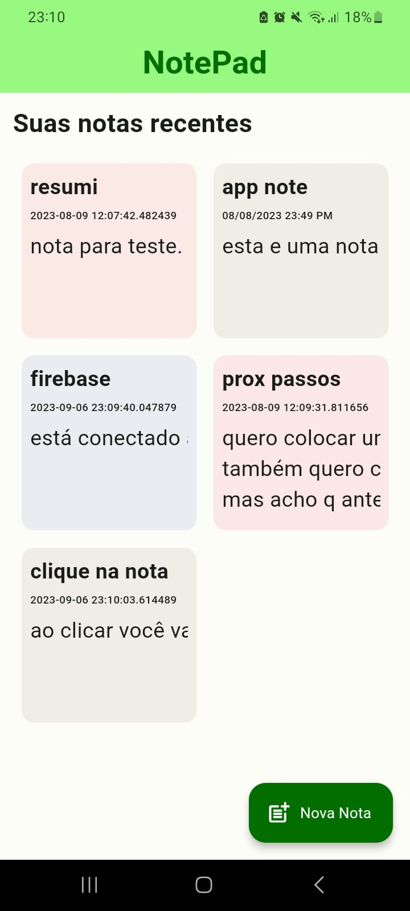

# Bloco de Notas

## Este é um bloco de notas simples feito com Flutter e Dart. 

### O app tem as seguintes funcionalidades: 
- Criar notas
- Editar notas
- Excluir notas

É um app simples, mas que pode ser usado como base para outros apps mais complexos. Pois tem as funcionalidades básicas de um app, esta bem organizado e comentado. Além de estar conectado ao Firebase, que é um serviço de banco de dados em nuvem, que pode ser usado para armazenar as notas.

Segue uma imagem do app(Não reparem na bagunça das notas, é só para mostrar que o app funciona rs):

